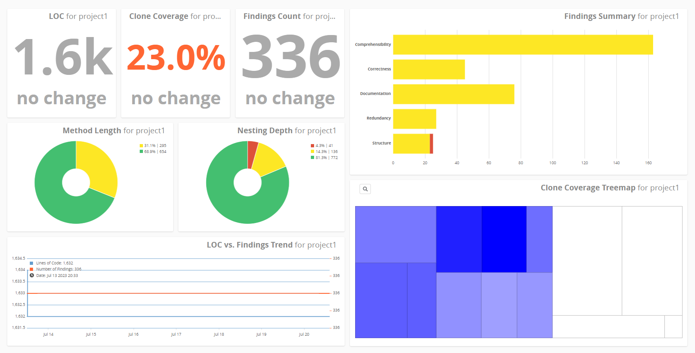

### 
CONCORDIA UNIVERSITY

### 
DEPARTMENT OF COMPUTER SCIENCE AND SOFTWARE ENGINEERING

### 
SOEN 6431: SOFTWARE COMPREHENSION AND MAINTENANCE: SECTION BB

### 
SUMMER 2023

### 
DÉJÀ VU

# INTRODUCTION

# DÉJÀ VU

This project's aim is to develop decision-making skills through the theory and practise of reengineering the source code of a chosen system. The project researches the maintainability of the chosen technology (as specified by the ISO/IEC 25010 Standard) in order to system.

## Team Composition

Team F

| Name  | Student ID | E-mail |
|-------|------------|--------|
|Preet Angad Singh Nanda | 40234930 | preetangad107@gmail.com |
|Varun Pandey | 40225320 | varunpne@gmail.com |
|Mir Pankaj Pasad | 40253287 | pasadmir2000@gmail.com |
|Mahavir Patel | 40198619 | mahavirpatel0@gmail.com |

## Roles and responsibilities for Deliverable 1

|Name/Problem                        |Research          |Ideation |Code Quality Checks|Disccusion|Documentation|
|:----------------------------------:|:----------------:|:-------:|:-------------:|:--------:|:-----------:|
|Preet Angad Singh Nanda             |✔                 |✔       |✔               |✔          |✔            |
|Varun Pandey                        |✔                 |✔         |✔               |✔         |✔             | 
|Mir Pankaj Pasad                    |✔                 |✔         |✔             |✔          |✔           |
|Mahavir Patel                       |✔                 |✔         |✔               |✔         |✔            |

## Roles and responsibilities for Deliverable 2

|Name/Problem                        |Research          |Code Refactoring |Code Quality Checks|Disccusion|Documentation|
|:----------------------------------:|:----------------:|:-------:|:-------------:|:--------:|:-----------:|
|Preet Angad Singh Nanda             |✔                 |✔       |✔               |✔          |✔            |
|Varun Pandey                        |✔                 |✔         |✔               |✔         |✔             | 
|Mir Pankaj Pasad                    |✔                 |✔         |✔             |✔          |✔           |
|Mahavir Patel                       |✔                 |✔         |✔               |✔         |✔            |

## TeamScale 

### Before Refactoring

### After Refactoring

%20REENGINEERING%20OPERATIONALIZATION/images/refactoring%20report%20after.jpeg)
